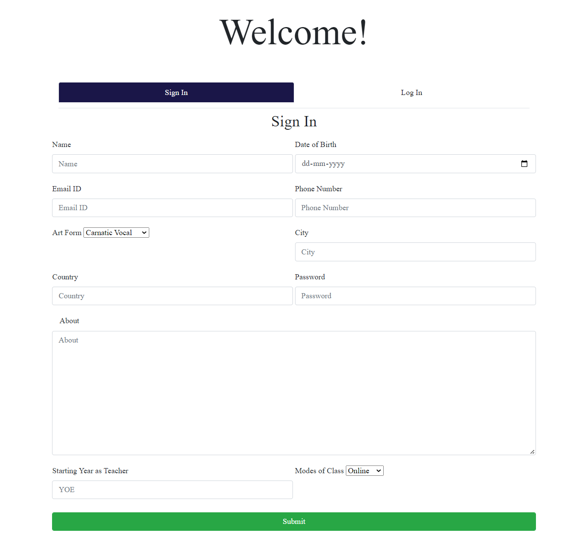
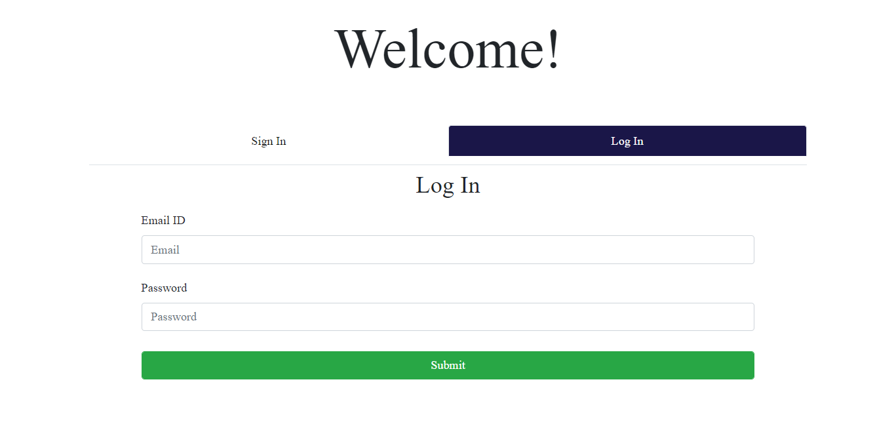
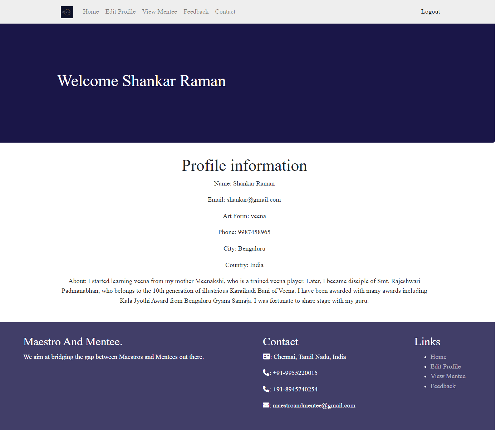
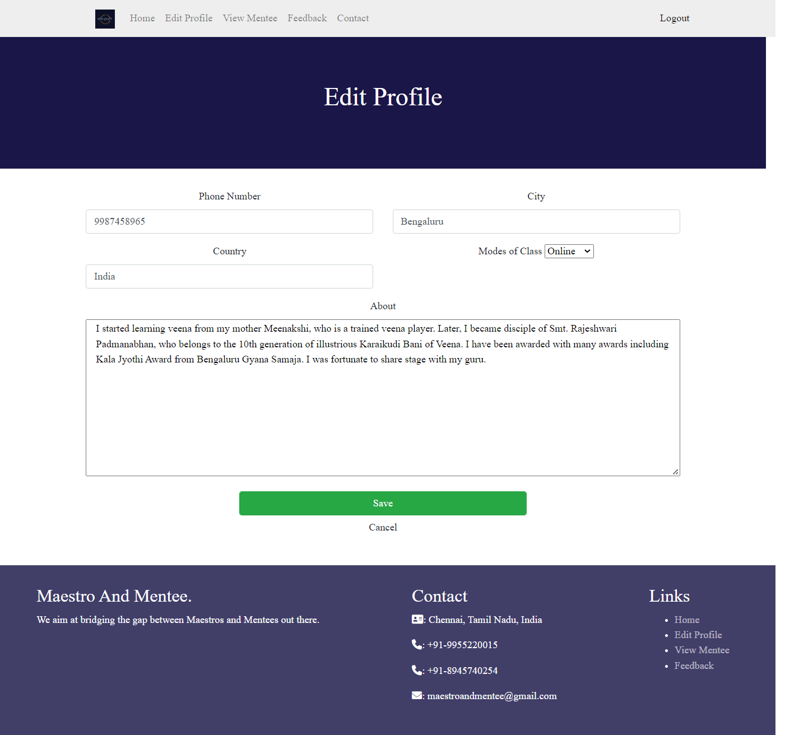
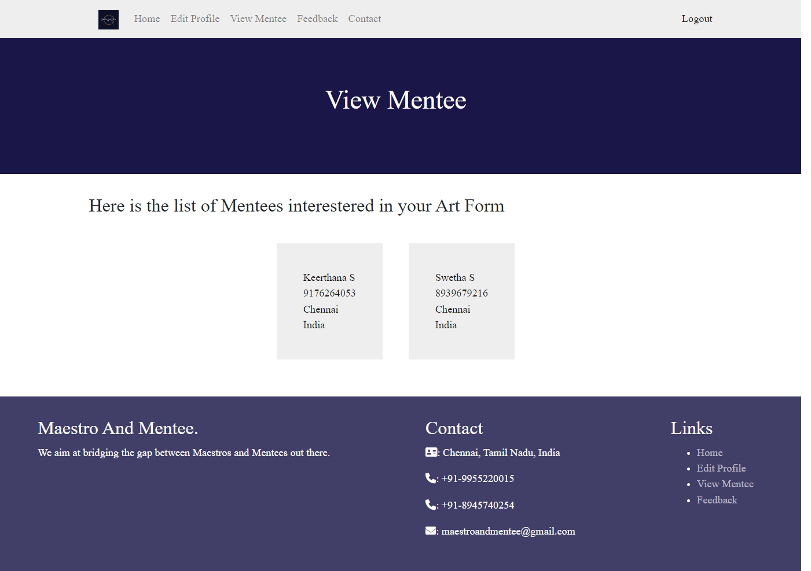
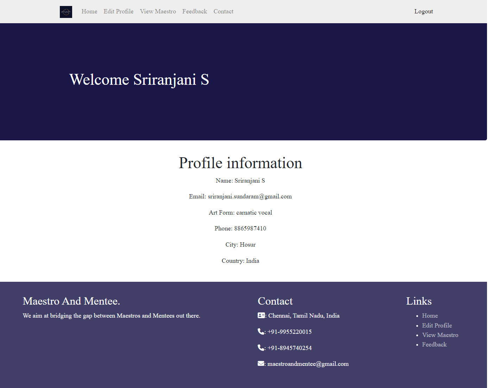
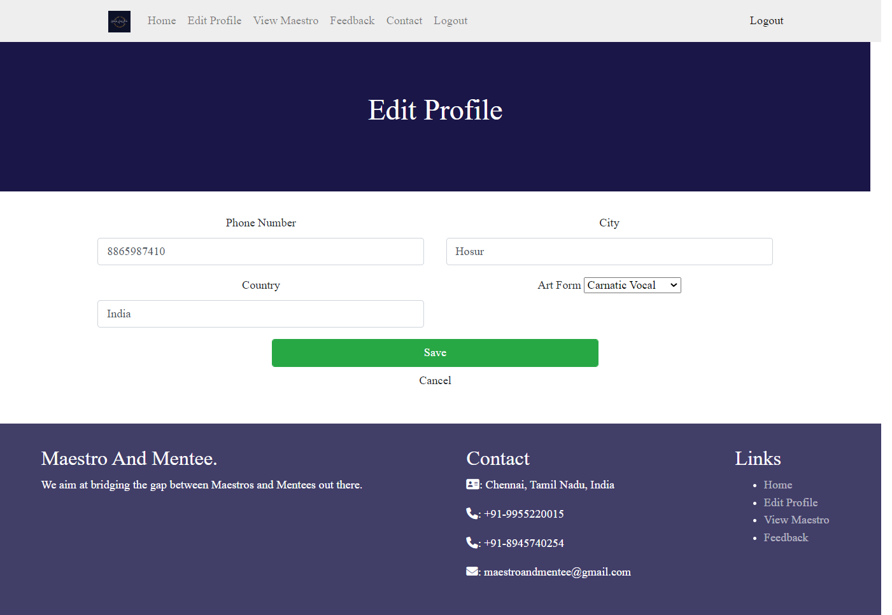
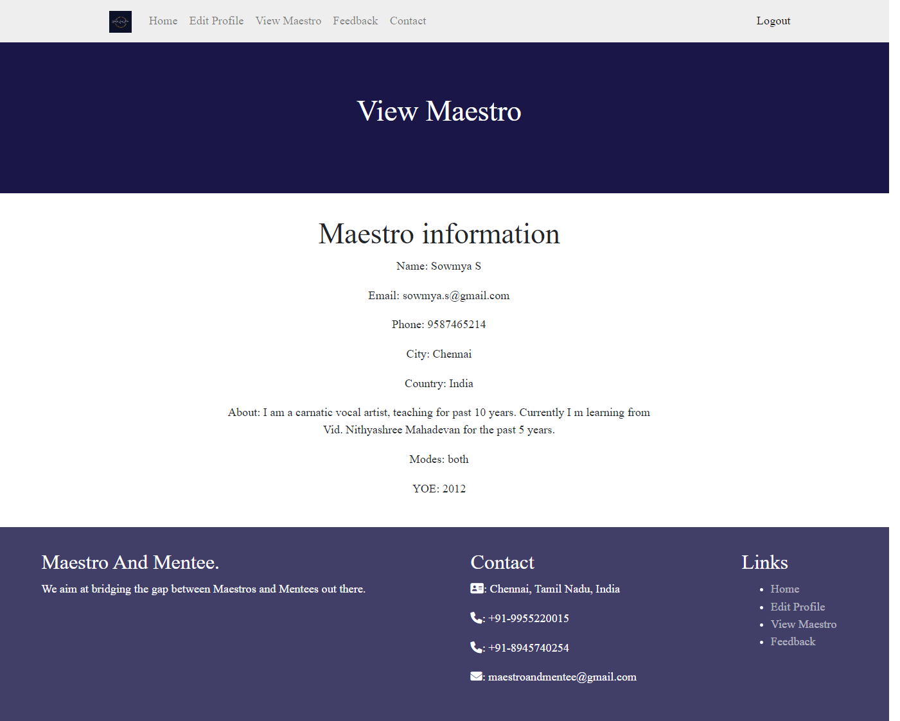
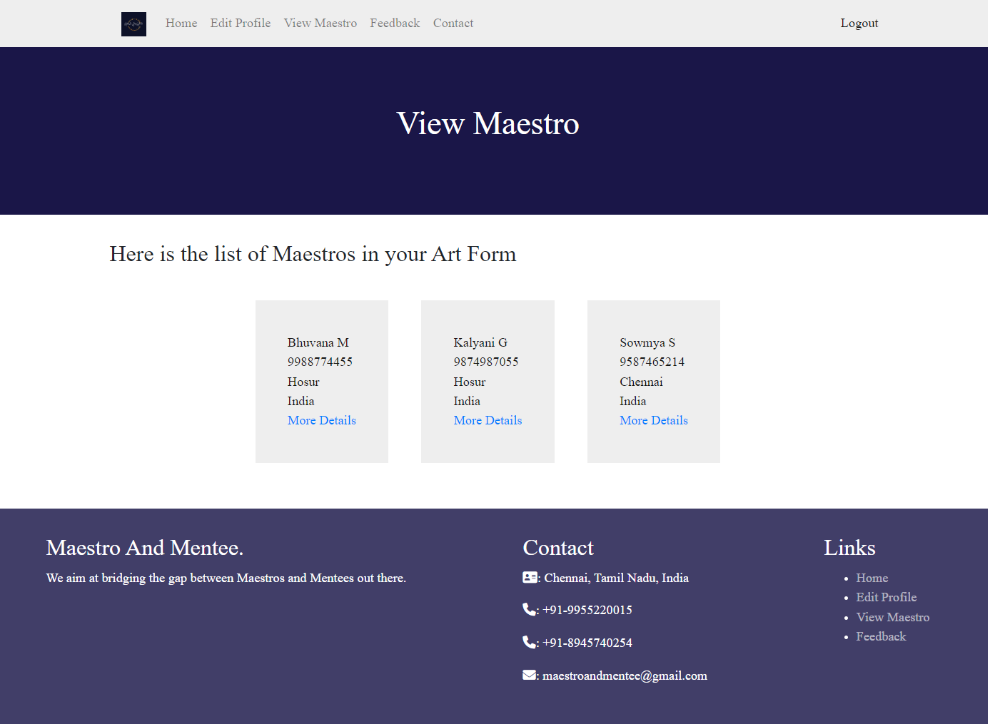
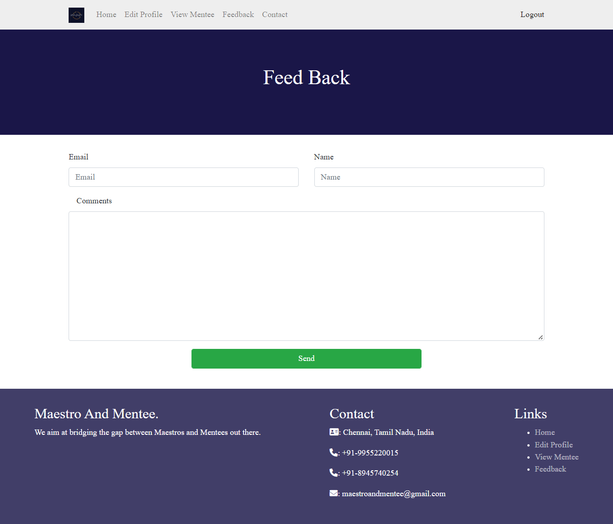

# MaestroAndMentee

The main aim of Maestro And Mentee is to connect the mentees searching for a teacher and a maestro looking for a suitable mentee in the field of art form.
This base idea has been implemented using HTML, CSS, PHP and Bootstrap.

Brand Logo:
 

 

In this website, a mentee can sign up/ log in and look for teachers in the interested art form and a maestro can sign up/ log in to view the interested mentees in his/ her art form.

Here comes the screenshots of the website:

Disclaimer: The info given in the screenshots are just samples, not to be misled

Landing Page:
 

 

Sign Up Page:
 

 

Log In Page:
 

 

Maestro's Page:
 

 

 

 

Mentee's Page:
 

 

 

 

 

Feedback Page:
 

 
